# 🌲 Federated Proactive Forest

**Federated Proactive Forest** is a high-performance, production-grade **horizontal federated learning (HFL)** framework built on top of the **Proactive Forest** ensemble algorithm (Cepero, 2023). This repository provides a scientifically rigorous environment designed to systematically study, evaluate, and optimize tree-based aggregation strategies in distributed, non-IID, and highly heterogeneous data environments. 

By balancing **accuracy** (individual tree classification performance) and **diversity** (using advanced information-theoretic and prediction-based diversity criteria), this framework bridges the gap between traditional federated ensemble methods and communication-efficient distributed intelligence.

---

[](https://www.python.org/)
[](LICENSE)
[](https://github.com/nik-f-v/flex-framework)

---

## ✨ What's New

*   **Deterministic Validation & Seeding Fixes**: Resolved client-side seed alignment and server-side ledger state persistence issues to eliminate run-to-run duplicate results and guarantee scientific reproducibility.
*   **Enhanced Testing Suite**: Comprehensive test coverage for aggregation strategies, label services, and federated orchestration.
*   **Improved CLI Integration**: Streamlined command-line interface with better error handling and configuration validation.
*   **Optimized Hyperparameter Search**: Integrated Optuna-driven Bayesian search and optimization (`run_unified_optimization.py`, `unified_hyperparameter_search.py`) for faster convergence analysis.
*   **Production-Grade Benchmarking**: Fully automated benchmark pipeline (`final_benchmark.py`) with robust checkpoint and recovery mechanisms.
*   **Statistical Validation**: Non-parametric Friedman tests and Wilcoxon post-hoc analyses with Bonferroni correction for rigorous strategy comparison.
*   **Python 3.12+ Standardization**: Full compatibility and optimization for Python 3.12+ with updated dependency versions.

---

## 🎯 Key Capabilities

*   🌳 **12 Aggregation Strategies**: Native support for S1–S7 (ranking-based) and 5 distinct variants of the S8 Global Roulette strategy.
*   📡 **Native FLEX Integration**: Built directly upon the FLEX Federated Learning Framework to ensure robust client-server orchestration, parallel execution, and standardized connection pools.
*   📉 **Non-IID Heterogeneity Handling**: Full Dirichlet-based data partitioning simulates realistic real-world client data skew, allowing researchers to evaluate strategy resilience under severe distribution shifts.
*   ⚖️ **Weighted Hybrid Prediction**: An intelligent voting mechanism that mathematically combines local client expertise with global generalized knowledge using highly configurable weight ratios.
*   🎰 **S8 Global Roulette**: An ultra-low bandwidth strategy that exchanges statistical attribute importance vectors instead of complex decision tree structures, reducing communication payloads by up to 99%.
*   🔄 **Label Normalization Service**: A centralized `LabelService` that guarantees consistent categorical class indexing and cross-client class alignments, eliminating out-of-vocabulary shifted predictions.
*   🌐 **Interactive Analysis UI**: A comprehensive 5-page Streamlit web interface showcasing real-time runs, dynamic metric analysis, interactive tree-ranking tables, and attribute roulette evolution heatmaps.
*   🧪 **Research-Grade Benchmarking**: Fully automated, parallel cross-validation script (`final_benchmark.py`) with integrated non-parametric statistical tests (Friedman and post-hoc Wilcoxon with Bonferroni correction).

---

## 📋 Table of Contents

1.  [🌲 Header & Introduction](#-federated-proactive-forest)
2.  [✨ What's New](#-whats-new)
3.  [🎯 Key Capabilities](#-key-capabilities)
4.  [🚀 Installation & System Requirements](#-installation--system-requirements)
5.  [⚡ Quick Start Guide](#-quick-start-guide)
6.  [📊 Supported Datasets](#-supported-datasets)
7.  [🏆 Aggregation Strategies & Tree Selection](#-aggregation-strategies--tree-selection)
8.  [🏗️ System Architecture & Hexagonal Design](#-system-architecture--hexagonal-design)
9.  [🌐 Interactive Streamlit Web UI](#-interactive-streamlit-web-ui)
10. [💻 CLI & Configurations](#-cli--configurations)
11. [📓 Jupyter Notebooks & Optimization](#-jupyter-notebooks--optimization)
12. [⚙️ Advanced Configuration](#-advanced-configuration)
13. [🔧 Developer Guide: Adding Custom Datasets](#-developer-guide-adding-custom-datasets)
14. [🧪 Testing Suite](#-testing-suite)
15. [📊 Research Scripts & Statistical Validation](#-research-scripts--statistical-validation)
16. [📈 Decision Guide & Troubleshooting](#-decision-guide--troubleshooting)
17. [📄 Authors, Citations & License](#-authors-citations--license)

---

## 🚀 Installation & System Requirements

### 💻 System Requirements
*   **Operating System**: Windows 10/11, macOS 11.0+, or Ubuntu 20.04+ LTS.
*   **Python Version**: `Python 3.12` or higher (fully standardized).
*   **RAM**: Minimum 4GB (8GB+ recommended for large-scale parallel runs).
*   **Storage**: 2GB of free disk space for built-in datasets, logs, and benchmark output caching.

### 🛠️ Installation Steps

1.  **Clone the Repository**
    ```bash
    git clone https://github.com/AdrianRodriguezJorge/federated_proactive_forest.git
    cd federated_proactive_forest
    ```

2.  **Create and Activate a Standard Virtual Environment**
    Standardize environment configuration on `venv_py312`:
    *   **Windows (PowerShell/CMD)**:
        ```bash
        py -3.12 -m venv venv_py312
        venv_py312\Scripts\activate
        ```
    *   **macOS / Linux**:
        ```bash
        python3.12 -m venv venv_py312
        source venv_py312/bin/activate
        ```

3.  **Install Standard Dependencies**
    First, install core dependencies from requirements.txt:
    ```bash
    pip install --upgrade pip setuptools wheel
    pip install -r requirements.txt
    ```

4.  **Install the Package in Development Mode**
    This enables direct imports from `src/` and installs optional extras:
    ```bash
    pip install -e .
    ```

5.  **Install Optional Extras (Recommended for Full Features)**
    Choose the extras you need based on your use case:
    
    ```bash
    # UI dependencies (Streamlit & Plotly) - for web interface
    pip install -e ".[ui]"

    # Developer & Testing tools (pytest & coverage) - for running tests
    pip install -e ".[dev]"

    # Hyperparameter optimization (Optuna & Joblib) - for Optuna search
    pip install -e ".[opt]"

    # FLEX Framework orchestration (Full federated learning support) - Highly Recommended
    pip install -e ".[flex]"

    # All extras at once
    pip install -e ".[ui,dev,opt,flex]"
    ```

6.  **Verify Installation**
    Run this quick import check to confirm the core model compiles successfully:
    ```bash
    python -c "from src.domain.model.proactive_forest import ProactiveForest; print('✅ Core ProactiveForest imported successfully!')"
    ```

---

## ⚡ Quick Start Guide

Choose your preferred interaction method:

### 🌐 Option 1: Interactive Web UI (Recommended for First-Time Users)
Launch the pre-configured Streamlit dashboard to visually configure and run federated rounds without touching code:
```bash
streamlit run src/interfaces/streamlit/app.py
```
Then open `http://localhost:8501` in your browser and follow these steps:
1.  Navigate to **⚙️ Configuration** and select the *Iris* dataset, 3 clients, and the `S7` strategy.
2.  Click **▶️ Run Experiment** to watch the real-time execution progress.
3.  Examine selected vs. discarded decision trees under **🏆 Tree Ranking**.
4.  Analyze the confusion matrix and macro F1 scores in **📊 Complete Metrics**.

### 💻 Option 2: CLI with YAML Configuration (For Reproducible Experiments)
Execute pre-configured experiment pipelines from YAML files:
```bash
python -m src.interfaces.cli.main --config configs/experiments/exp_s7_perclient_f1_pcd.yaml
```

Quick parameter overrides:
```bash
python -m src.interfaces.cli.main --dataset Iris --clients 3 --strategy s7_perclient_f1_pcd --trees 50
```

### 🐍 Option 3: Programmatic Execution (For Custom Workflows)
Directly use the framework APIs in Python for fine-grained control:

```python
from src.application.orchestrators.fl_orchestrator import FLEXOrchestrator
from src.infrastructure.dataset.dataset_factory import DatasetFactory

# 1. Load and parse dataset
adapter = DatasetFactory.create_adapter({"type": "Iris"})
dataset_split = adapter.load()

# 2. Define federated configuration
config = {
    "federation": {
        "n_clients": 3,
        "distribution": "noniid_dirichlet",
        "dirichlet_alpha": 0.5
    },
    "model": {
        "n_estimators": 50,
        "alpha": 0.1,
        "bootstrap": True
    },
    "aggregation": {
        "strategy": "s7_perclient_f1_pcd",
        "f1_weight": 0.7,
        "pcd_weight": 0.3
    },
    "prediction": {
        "local_weight": 0.4,
        "global_weight": 0.6
    }
}

# 3. Execute federated orchestration
orchestrator = FLEXOrchestrator(config)
orchestrator.setup_federation(dataset_split)
results = orchestrator.run_federated_round(n_bootstrap=0)

# 4. Extract and display metrics
print(f"✅ Global Model Accuracy: {results.global_accuracy:.4f}")
print(f"✅ Active Trees in Global Pool: {results.n_trees_global}")
```

---

The repository comes equipped with 11 built-in multi-class classification datasets pre-loaded under the `data/` directory.

| Dataset | Samples | Features | Classes | Type | Key Challenges |
| :--- | :--- | :--- | :--- | :--- | :--- |
| **Iris** | 150 | 4 (Numeric) | 3 | Numerical | Linear separability baseline |
| **Car Evaluation** | 1,728 | 6 (Categorical) | 4 | Categorical | Heavy class imbalance |
| **Nursery** | 12,960 | 8 (Categorical) | 5 | Categorical | Large scale categorical features |
| **Vowel** | 990 | 10 (Numeric) | 11 | Numerical | High-class dimensionality |
| **Letter Recognition** | 20,000 | 16 (Numeric) | 26 | Numerical | Massive sample size and complex shapes |
| **Optdigits** | 5,620 | 64 (Numeric) | 10 | Numerical | High feature-space dimensionality |
| **Sonar** | 208 | 60 (Numeric) | 2 | Numerical | Low sample ratio vs high feature space |
| **Spambase** | 4,601 | 57 (Numeric) | 2 | Numerical | Complex binary classification skew |
| **Glass** | 214 | 9 (Numeric) | 6 | Numerical | Glass classification, high class imbalance |
| **Molecular** | 106 | 57 (Categorical) | 2 | Categorical | Small sample size, high categorical dimensions |
| **Pendigits** | 10,992 | 16 (Numeric) | 10 | Numerical | Handwritten digit recognition |

### 📈 Data Partitioning: IID vs. Non-IID Dirichlet
Data partitioning across clients is handled transparently by the `FedDataDistributor`.
*   **IID (Independent and Identically Distributed)**: The global dataset is shuffled and distributed uniformly. Every client receives an identical, unbiased class distribution.
*   **Non-IID Dirichlet**: A Dirichlet distribution ($\text{Dir}(\alpha)$) determines class allocations per client. 
    *   A **lower alpha ($\alpha < 0.5$)** generates extreme class imbalances, meaning some clients may only receive samples of one or two classes. This represents a heavy real-world distribution skew.
    *   A **higher alpha ($\alpha \to \infty$)** converges back to a uniform, IID partition.

---

## 🏆 Aggregation Strategies & Tree Selection

To systematically evaluate how local trees are selected, merged, and distributed, the framework implements **12 distinct aggregation strategies**.

### 📋 Unified Aggregation Strategy Table

| Strategy ID | Name | Core Criterion | Bandwidth Overhead | Mathematical Objective |
| :--- | :--- | :--- | :--- | :--- |
| **S1** | Simple Pool | Complete Merge | **High** (All trees sent) | Combines all client-trained trees without filtering. |
| **S2** | Global Accuracy Ranking | Out-of-Bag Accuracy | **Medium** (Sorted subset) | Filters and ranks trees on a global Validation Set by accuracy. |
| **S3** | Global Macro-F1 Ranking | Out-of-Bag Macro-F1 | **Medium** (Sorted subset) | Ranks globally using Macro-F1 to handle class-imbalanced pools. |
| **S4** | Global Hybrid Ranking | Macro-F1 + Diversity (PCD) | **Medium** (Cooperative PCD) | Ranks globally via $\alpha \cdot \text{F1} + \beta \cdot \text{PCD}$ to maximize ensemble diversity. |
| **S5** | Per-Client Accuracy Ranking | Local Out-of-Bag Acc | **Medium** (Per-client subset) | Selection done independently per client based on local validation accuracy. |
| **S6** | Per-Client Macro-F1 Ranking | Local Out-of-Bag F1 | **Medium** (Per-client subset) | Selection done independently per client based on local validation Macro-F1. |
| **S7** | Per-Client Hybrid Ranking | Local F1 + Local PCD | **Medium** (Per-client diversity) | Client-level selection maximizing local accuracy and local diversity. |
| **S8_MEAN** | Roulette Simple Mean | Attribute Mean | **Ultra-Low** (Vector only) | Aggregates feature probabilities via simple arithmetic mean of vectors. |
| **S8_WEIGHTED** | Roulette Weighted Avg | Client Data Size Weight | **Ultra-Low** (Vector only) | Vector aggregation weighted proportionally to client training set sizes. |
| **S8_MEDIAN** | Roulette Robust Median | Coordinate Median | **Ultra-Low** (Vector only) | Employs median filtering to neutralize noisy/adversarial client vectors. |
| **S8_CONSENSUS** | Roulette Consensus | Performance Consensus | **Ultra-Low** (Vector only) | Weights client vectors dynamic-historically based on validation accuracy. |
| **S8_PROACTIVE_PCD**| Roulette Proactive PCD | Diversity-Weighted PCD | **Ultra-Low** (Vector only) | Adapts probability vectors based on localized feature-correct diversity scores. |

---

### 🎰 Unified S8 (Global Attribute Roulette) Documentation

The **S8 Global Attribute Roulette** represents the pinnacle of communication-efficient horizontal federated learning within this codebase. It is strictly designed for extreme edge-computing scenarios where network bandwidth is the primary bottleneck.

#### ⚙️ The Vector-Exchange Paradigm
Rather than transmitting massive serialized Random/Proactive Forest structures (which consume megabytes of payload and introduce structural intellectual property leakage), S8 exchanges simple **one-dimensional attribute selection probability vectors** ($p \in \mathbb{R}^{d}$, where $d$ is the number of features).

```
[ Client 1 ] --(p1 vector)--> [                   ]
[ Client 2 ] --(p2 vector)--> [ Global Server     ] --(Aggregated P)--> [ Clients Update ]
[ Client 3 ] --(p3 vector)--> [ Vector Aggregator ]                     [ Probabilities  ]
```

1.  **Local Step**: Each client trains a local Proactive Forest. The client extracts feature importance scores (the probability of feature selection during split generation).
2.  **Aggregation Step**: The server gathers these raw vectors and performs mathematical consolidation based on the selected S8 variant:
    *   **Mean**: $\mathbf{p}_{\text{global}} = \frac{1}{K} \sum_{k=1}^{K} \mathbf{p}_k$
    *   **Weighted**: $\mathbf{p}_{\text{global}} = \sum_{k=1}^{K} \frac{N_k}{\sum N_i} \mathbf{p}_k$ (where $N_k$ is the local sample size of client $k$).
    *   **Median**: $\mathbf{p}_{\text{global}} = \text{median}(\mathbf{p}_1, \dots, \mathbf{p}_K)$ (coordinate-wise median filtering out malicious or corrupted client anomalies).
    *   **Consensus**: Dynamic weight adjustment based on client validation macro F1 performance over the previous round.
    *   **Proactive PCD**: Adjusts global probability dimensions to explicitly prioritize features that yield highly correct, non-overlapping classifications among cooperative nodes.
3.  **Distribution Step**: The aggregated vector is returned to all clients. In the subsequent training step, clients initialize their tree-growing splitting processes using the server's global probability vector, directly incorporating distributed feature significance without transferring a single tree.

> [!NOTE]
> S8 reduces communication payloads by over **99%** compared to S1-S7, while successfully preserves local privacy since no tree structures or exact data bounds ever leave the client nodes.

---

### 🧬 PCD & Hybrid Selection Weights (S4, S7)
For hybrid strategies, the overall ranking metric is defined as:
$$\text{Score} = w_{\text{performance}} \cdot \text{MacroF1} + w_{\text{diversity}} \cdot \text{PCD}$$

To configure these weights, edit the YAML block under the `aggregation` key:
```yaml
aggregation:
  strategy: "s7_perclient_f1_pcd"
  f1_weight: 0.7
  pcd_weight: 0.3    # Automatically normalized if they do not sum to 1.0
```

---

### 🛠️ Key Architectural Refinements & Bug Fixes

To guarantee absolute scientific integrity, the following major engineering fixes have been implemented:

*   **Strict Hybrid Predictor Isolation**: Client-server self-representation bias has been resolved. In per-client hybrid predictions, a client's local forest is strictly isolated and excluded from the "global forest" subset it downloads. This ensures that validation scores do not artificially inflate through self-evaluation.

---

## 🏗️ System Architecture & Hexagonal Design

The repository strictly adheres to **Hexagonal Architecture (Ports and Adapters)**. This guarantees complete separation between core algorithmic models, application orchestrators, infrastructure adapters, and presentation interfaces.

### 📁 Codebase Structure Map

```
src/
├── domain/                         # 📦 Pure Enterprise & Algorithm Core (Framework-Agnostic)
│   ├── model/                      #   ├── ProactiveForest (Ensemble building, convergence)
│   │                               #   └── DecisionTree (Custom split, entropy/gini evaluation)
│   ├── aggregation/                #   ├── Selection Strategies (S1-S7, S8)
│   │                               #   └── StrategyFactory
│   ├── metrics/                    #   └── ForestEvaluator (OOB scoring, multi-class validation)
│   ├── services/                   #   ├── LabelService (Centralized cross-client index mapping)
│   │                               #   └── PredictionBasedDiversityService (PCD calculation)
│   └── prediction/                 #   └── HybridPredictor (Strictly isolated voting)
│
├── application/                    # 🎯 Orchestration & Application Boundaries
│   ├── orchestrators/              #   ├── FLEXOrchestrator (Standard FL coordinator)
│   │                               #   ├── RouletteOrchestrator (S8 attribute vector loop)
│   │                               #   ├── FedDataDistributor (Dirichlet & IID data splitter)
│   │                               #   └── result_consolidator (Test performance parser)
│   └── hyperparam_optimizer.py     #   └── Local Bayesian Optuna tuner
│
├── infrastructure/                 # 🔌 Infrastructure Adapters
│   ├── dataset/                    #   ├── DatasetFactory
│   │                               #   └── Dataset Adapters (IrisAdapter, CsvDatasetAdapter)
│   ├── flex/                       #   └── Native FLEX Framework connectors (Pools, actors)
│   └── persistence/                #   └── CSV result logger and benchmark checkpoint save
│
└── interfaces/                     # 🎨 Presentation Layer
    ├── cli/                        #   └── CLI entrypoint and argument parser
    ├── streamlit/                  #   └── streamlit/app.py (Web Interface UI pages)
    └── notebooks/                  #   └── research notebooks & Optuna search space analysis
```

### 💡 Architectural Justification & Hexagonal Ports/Adapters

The main driver behind choosing **Hexagonal Architecture** is the complete decoupling of domain logic from third-party frameworks and client/server transport mechanisms. 

1. **Framework Independence**: The orchestration logic uses interfaces ("ports") to interact with data and external frameworks. The `FLEXOrchestrator` relies on FLEX under the hood, but the core `ProactiveForest` and its `IAggregationStrategy` subclasses have zero knowledge of FLEX. This allows swapping FLEX with other federated environments (e.g. Flower, gRPC, or even PySyft) by just writing a new infrastructure adapter.
2. **Strict Domain Isolation**: The business rules—such as how trees are grown under the proactive learning strategy, and how diversity (PCD) is computed—are kept pure inside `src/domain`. They do not depend on Pandas, Streamlit, or FLEX, which minimizes the impact of third-party dependency updates on core algorithms.
3. **Rigorous Testability**: Because the domain is isolated, tests in `tests/` can run entirely in-memory using pure mock adapters without initializing network pools, multi-process actors, or complex Streamlit state contexts. This guarantees extremely fast and predictable test execution.

---

### 🎨 Design Patterns & Principles

To maintain high extensibility, readability, and code quality, the following design patterns are actively utilized:

#### 1. **Strategy Pattern**
* **Implementation**: Defined by the `IAggregationStrategy` abstract class in `src/domain/aggregation/base_strategy.py`.
* **Details**: Every client-server aggregation algorithm (from `S1SimplePoolStrategy` up to `S8RouletteStrategy`) inherits from `IAggregationStrategy` and implements the `aggregate(...)` method.
* **Justification**: This decouples the orchestrator from concrete selection algorithms. When adding a new strategy, developers only need to write a new strategy class implementing `IAggregationStrategy`, without modifying the orchestration train loops.

#### 2. **Factory Pattern**
* **Implementation**: Implemented in `AggregationFactory` (`src/domain/aggregation/aggregation_factory.py`) and `DatasetFactory` (`src/infrastructure/dataset/dataset_factory.py`).
* **Details**: `AggregationFactory` normalizes configuration strings (like `"s7_perclient_f1_pcd"`) to retrieve the corresponding concrete strategy class and construct it with the required dependency services.
* **Justification**: Centralizes object creation, keeping the client code clean of class imports and instantiations.

#### 3. **Dependency Injection (DI)**
* **Implementation**: Constructor-based injection of `IMetricsService` and `IDiversityService` interfaces into `IAggregationStrategy` implementations.
* **Details**: Instead of hardcoding sklearn metrics or custom PCD calculations, the strategy receives them as instances implementing interfaces, which can easily be replaced by mock objects during testing.

#### 4. **Adapter Pattern**
* **Implementation**: Implemented in `IDatasetAdapter` and concrete adapters like `CsvDatasetAdapter`.
* **Details**: The domain specifies a port (`IDatasetAdapter`) requiring a `load() -> DatasetSplit` method. The infrastructure layer provides `CsvDatasetAdapter` which reads files, encodes labels, and creates splits, wrapping these file-system specifics into a unified domain DTO (`DatasetSplit`).

#### 5. **Facade / Orchestrator Pattern**
* **Implementation**: Implemented by `FLEXOrchestrator` and `RouletteOrchestrator`.
* **Details**: These orchestrators act as unified controllers that wrap all complex sub-systems (data distribution, client actor mapping, aggregation, model deployment, and results consolidation) into single, readable workflows.
* **Justification**: Simplifies the entry points for the Streamlit UI and CLI, preventing them from having to coordinate multiple low-level FLEX primitives.

#### 6. **Builder Pattern**
* **Implementation**: Implemented by the `TreeBuilder` class in `src/domain/model/cpf_implementation/tree_builder.py`.
* **Details**: Separates the complex, step-by-step recursive creation of decision trees (`build_tree`) from their model representations (`DecisionTree` / `ProactiveForest`).
* **Justification**: Isolates the recursive splitting logic from high-level estimator interfaces, improving readability and code maintenance.

#### 7. **Decorator Pattern**
* **Implementation**: Used at both the language level (Python's `@abstractmethod`, `@classmethod`, `@property`) and framework level (FLEX framework's `@collect_clients_weights`, `@init_server_model`, etc.).
* **Details**: Wraps server and client primitives to inject serialization, communication, and synchronization behaviors dynamically without cluttering domain logic.
* **Justification**: Separates core algorithmic logic from the communication/orchestration framework constraints.

#### 8. **Mediator Pattern**
* **Implementation**: Facilitated architecturally by `FLEXOrchestrator` and `RouletteOrchestrator`.
* **Details**: In horizontal federated learning, clients must not communicate directly. The central server (orchestrated by these controllers) acts as a mediator, coordinating weight collections and distributing aggregated states.
* **Justification**: Maintains independence and decoupling between distributed worker nodes.

---

### 📊 Design Class Diagram

The following PlantUML diagram maps the design patterns and architectural layers. It illustrates how components are distributed across **Domain, Application, Infrastructure, and Interface** boundaries, and how they relate through ports and adapters:

```plantuml
@startuml
skinparam class {
    BackgroundColor #F8F9FA
    ArrowColor #2D5889
    BorderColor #2D5889
}
skinparam stereotypeCBackgroundColor #D9E1F2

package "Capa de Interfaces (Presentación)" {
    class StreamlitAppUI {
        + run()
    }
    class CLIEntryPoint {
        + main()
    }
}

package "Capa de Aplicación (Orquestación)" {
    class FLEXOrchestrator {
        - config: dict
        - metrics_svc: IMetricsService
        - diversity_svc: IDiversityService
        - label_svc: SimpleLabelService
        + setup_federation(dataset_split: DatasetSplit)
        + run_federated_round(): FLResults
    }
    class RouletteOrchestrator {
        - config: dict
        + setup_federation(dataset_split: DatasetSplit)
        + run_federated_round(): FLResults
    }
    class FedDataDistributor {
        + distribute(dataset_split: DatasetSplit, seed: int): Tuple
    }
}

package "Capa de Dominio (Núcleo Hexagonal)" {
    interface IAggregationStrategy <<Strategy>> {
        + metrics_svc: IMetricsService
        + diversity_svc: IDiversityService
        + aggregate(client_trees, client_metadata, ...): Tuple
        + strategy_id(): String
    }

    interface IDatasetAdapter <<Port>> {
        + load(): DatasetSplit
        + name(): String
        + n_classes(): int
    }

    interface IMetricsService <<Port>> {
        + compute_accuracy(): float
        + compute_f1(): float
    }

    interface IDiversityService <<Port>> {
        + compute_diversity(): float
    }

    class ProactiveForest {
        - n_estimators: int
        - alpha: float
        - trees: List<DecisionTree>
        + fit(X, y)
        + predict(X): np.ndarray
    }

    class DecisionTree {
        - root: Node
        + predict(X)
    }

    class TreeBuilder <<Builder>> {
        + build_tree(X, y, n_classes): DecisionTree
    }

    class DatasetSplit {
        + X_train: np.ndarray
        + y_train: np.ndarray
        + X_test: np.ndarray
        + y_test: np.ndarray
        + get_all_labels(): np.ndarray
    }

    class SimpleLabelService {
        + fit(labels)
        + transform(labels): np.ndarray
        + inverse_transform(indices): np.ndarray
    }

    class AggregationFactory <<Factory>> {
        + create_strategy(name: String): IAggregationStrategy
    }

    class S1SimplePoolStrategy {
        + aggregate(...): Tuple
    }

    class S7PerClientF1PCDStrategy {
        + aggregate(...): Tuple
    }

    class S8RouletteStrategy {
        + aggregate(...): Tuple
    }

    class PredictionBasedDiversityService {
        + compute_pcd(predictions): float
    }
}

package "Capa de Infraestructura (Adaptadores)" {
    class CsvDatasetAdapter <<Adapter>> {
        - file_path: str
        + load(): DatasetSplit
    }
    class FlexPoolFactory <<Factory>> {
        + create_client_server_pool(...): FlexPool
    }
}

' Relaciones entre componentes
CLIEntryPoint --> FLEXOrchestrator : "Usa para ejecutar"
StreamlitAppUI --> FLEXOrchestrator : "Usa para ejecutar"
StreamlitAppUI --> RouletteOrchestrator : "Usa para ejecutar"

FLEXOrchestrator --> IDatasetAdapter : "Carga datos mediante"
FLEXOrchestrator --> IAggregationStrategy : "Aplica"
FLEXOrchestrator --> FedDataDistributor : "Delega particionamiento"
FLEXOrchestrator --> SimpleLabelService : "Normaliza etiquetas con"
FLEXOrchestrator --> AggregationFactory : "Resuelve estrategia via"
FLEXOrchestrator --> FlexPoolFactory : "Crea pool FLEX con"

' Herencias e Implementaciones
S1SimplePoolStrategy .up.|> IAggregationStrategy : "Implementa"
S7PerClientF1PCDStrategy .up.|> IAggregationStrategy : "Implementa"
S8RouletteStrategy .up.|> IAggregationStrategy : "Implementa"

CsvDatasetAdapter .up.|> IDatasetAdapter : "Implementa"
PredictionBasedDiversityService .up.|> IDiversityService : "Implementa"

IAggregationStrategy o-- IMetricsService : "Inyecta"
IAggregationStrategy o-- IDiversityService : "Inyecta"

' Composición y Creación
ProactiveForest "1" *-- "many" DecisionTree : "Contiene"
ProactiveForest --> TreeBuilder : "Delega creación a"
TreeBuilder ..> DecisionTree : "Construye"
IDatasetAdapter ..> DatasetSplit : "Produce"
@enduml
```



---

## 🌐 Interactive Streamlit Web UI

The graphical user interface is organized into **five isolated functional views**:

1.  **Page 1: Configuration**: Configure Dirichlet alpha coefficients, choose a dataset, set clients, strategy hyper-parameters (such as weights), and model parameters (e.g. `n_estimators`, `convergence_threshold`).
2.  **Page 2: Run Experiment**: Starts the training loop. Features a visual progress bar, interactive log stream, and a final model performance dashboard displaying overall accuracy, Macro-F1, and final tree counts.
3.  **Page 3: Tree Ranking**: Displays which trees were selected or discarded. In per-client strategies (S5-S7), users can filter selected trees per individual client, inspecting tree-level accuracy and OOB diversity.
4.  **Page 4: Complete Metrics**: Interactive Confusion Matrix plots (built with Plotly) and side-by-side bar charts comparing precision, recall, and Macro-F1 across all federated clients.
5.  **Page 5: Roulette Evolution (S8 Only)**: A dynamic, interactive heatmap showing how the global attribute selection probabilities ($p$-vector) evolve across training rounds. Ideal for verifying convergence of feature selection.

---

## 💻 CLI & Configurations

### ⚙️ standard YAML Configuration Structure
Experiments can be fully defined inside YAML files:

```yaml
# configs/experiments/exp_s7_perclient_f1_pcd.yaml
dataset:
  type: "Iris"
  file_path: "data/iris.csv"

federation:
  n_clients: 5
  distribution: "noniid_dirichlet"
  dirichlet_alpha: 0.5

model:
  n_estimators: 100
  alpha: 0.1
  convergence_threshold: 0.002
  voting: "soft"

aggregation:
  strategy: "s7_perclient_f1_pcd"
  f1_weight: 0.7
  pcd_weight: 0.3
```

### 📂 Pre-configured Scenarios in `configs/experiments/`
*   `exp_s1_simple_pool.yaml`: Reference configuration combining all client trees.
*   `exp_s4_global_f1_pcd.yaml`: Global F1-score and PCD-diversity ranking.
*   `exp_s7_perclient_f1_pcd.yaml`: Per-client adaptive selection based on local metrics.
*   `exp_s8_consensus.yaml`: Performance-consensus-weighted Global Attribute Roulette.
*   `exp_s8_proactive_pcd.yaml`: S8 variation prioritizing features that optimize class-correct diversity.
*   `exp_s8_mean.yaml`, `exp_s8_median.yaml`, `exp_s8_weighted.yaml`: Basic statistical Roulette aggregations.

### 🚀 Running Targeted CLI Commands
```bash
# Run a specific experiment config file
python -m src.interfaces.cli.main --config configs/experiments/exp_s7_perclient_f1_pcd.yaml

# Run S7 over Iris using quick parameters overrides
python -m src.interfaces.cli.main --dataset Iris --clients 3 --strategy s7_perclient_f1_pcd --trees 50
```

---

## 📓 Jupyter Notebooks & Optimization

The repository includes research notebooks to facilitate interactive algorithm exploration and hyperparameter searches under `src/interfaces/notebooks/`:

*   **`baselines/centralized_baselines_comparison.ipynb`**: Evaluates centralized Random Forests vs. centralized Proactive Forests to set reference performance levels for federated gains.
*   **`optimization/optuna_s1.ipynb` through `optuna_s8.ipynb`**: Integrates **Optuna** to execute automated search space exploration on the strategies, helping researchers systematically discover optimal configurations for `alpha`, `f1_weight`, and client count thresholds.

---

## ⚙️ Advanced Configuration

### 🌳 Proactive Forest Hyperparameters
These are defined within the `model` key:
*   `n_estimators` (int): Maximum number of trees to grow per client (e.g. `100`).
*   `alpha` (float): Probability adjustments modifier; controls diversity vs accuracy focus during local tree creation.
*   `convergence_threshold` (float): Minimum variance change to continue growing trees. If accuracy changes fall below this (e.g., `0.002`), local training stops early to save computations.
*   `episode_size` (int): Interval size of grown trees checked to verify model convergence.

### ⚖️ Hybrid Prediction Ratios
Configure voting balance under the `prediction` key:
```yaml
prediction:
  local_weight: 0.3    # weight assigned to the client's local trees
  global_weight: 0.7   # weight assigned to aggregated global trees
```

---

## 🔧 Developer Guide: Adding Custom Datasets

To extend this framework to handle a new dataset, follow this 3-step guide:

### Step 1: Create the Dataset Adapter
Create a new file `src/infrastructure/dataset/new_dataset_adapter.py` inheriting from `IDatasetAdapter`:

```python
from src.domain.dataset.base_adapter import IDatasetAdapter, DatasetSplit
import pandas as pd

class NewDatasetAdapter(IDatasetAdapter):
    def __init__(self, file_path: str):
        self.file_path = file_path

    @property
    def name(self) -> str:
        return "NewDataset"

    @property
    def n_classes(self) -> int:
        return 3  # Return your dataset's unique classes count

    def load(self) -> DatasetSplit:
        df = pd.read_csv(self.file_path)
        X = df.drop(columns=["target"]).values
        y = df["target"].astype(str).values
        
        # Split into Train, Val, Test splits (e.g. 80-10-10)
        # Return a standardized DatasetSplit object
        return DatasetSplit(
            X_train=X[:80], X_val=X[80:90], X_test=X[90:],
            y_train=y[:80], y_val=y[80:90], y_test=y[90:],
            feature_names=["f1", "f2", "f3"],
            class_names=["class_0", "class_1", "class_2"],
            dataset_name=self.name
        )
```

### Step 2: Register in the Dataset Factory
Open `src/infrastructure/dataset/dataset_factory.py` and register your dataset's metadata presets in the `DATASET_METADATA` registry:

```python
DATASET_METADATA = {
    "NewDataset": {
        "target_column": "target",
        "sep": ",",
        "file_path": "data/new_dataset.csv"
    }
}
```

### Step 3: Wire into the UI Layer
Add your custom dataset type into the selectbox selector in `src/interfaces/streamlit/components/constants.py` and you are done! It will automatically load and partition within the UI.

---

## 🧪 Testing Suite

To maintain the architectural integrity of our domain logic, we enforce a strict automated testing policy.

### 🚀 Running the Tests
Execute the full test suite using `pytest`:
```bash
pytest tests/
```

### 📋 Test Modules Overview
*   **`test_aggregation.py`**: Validates the tree combination math for S1 (Simple Pool) and verifies selection boundaries.
*   **`test_fix_local_isolation.py`**: Ensures client local models are set up correctly, data is split, and out-of-bag scores are measured without network interaction.
*   **`test_label_service.py`**: Validates class/index consistency. Ensures that transforming multi-class arrays and executing `inverse_transform` yields identical strings.
*   **`test_metrics.py`**: Verifies dynamic Percentage Correct Diversity (PCD) calculations under extreme settings (such as zero diversity vs. maximum diversity).
*   **`test_proactive_forest.py`**: Validates core tree growth, split probabilities, and early stopping threshold activation.

---

## 📊 Research Scripts & Statistical Validation

The `scripts/` directory contains high-performance utilities designed for rigorous scientific validation and comparative analysis.

### 🏆 Automated Benchmarking (`final_benchmark.py`)
Comprehensive evaluation protocol: **10-fold cross-validation** over **5 repetitions** across all **8 datasets**, testing all **12 strategies**.

**Key Features:**
*   **Automatic Parallelism**: Leverages `joblib` with configurable `n_workers` for efficient resource utilization.
*   **Robust Checkpointing**: Automatically saves progress to `results/results_final_benchmark.csv` at each strategy completion. Resumable if interrupted.
*   **Memory Management**: Configurable worker count to prevent OOM errors on resource-constrained systems.

**Execution:**
```bash
# Standard execution (uses all available CPU cores)
python scripts/final_benchmark.py

# Configure number of workers for memory-constrained systems
# Edit n_workers = 2 inside final_benchmark.py before running
python scripts/final_benchmark.py
```

> **💡 Tip**: Average runtime is 30-90 minutes depending on hardware. For testing, temporarily reduce `n_folds` or `n_repetitions` in the script.

### 📉 Additional Research Scripts

*   **`run_unified_optimization.py`**: Unified Bayesian hyperparameter optimization script using Optuna. Optimizes a single joint hyperparameter vector across representative strategies (S1, S4, S7, S8) and datasets (Sonar, Vowel, Spambase, Nursery) to find a robust configuration profile.
    ```bash
    python scripts/run_unified_optimization.py
    ```

*   **`Friedman_test_new_results.py`**: Non-parametric statistical analysis. Performs Friedman rank-sum test to determine if strategy differences are statistically significant.
    ```bash
    python scripts/Friedman_test_new_results.py
    ```

---

---

## 📈 Decision Guide & Troubleshooting

### 📋 Strategy Selection Matrix

| Use Case Scenario | Recommended Strategy | Bandwidth Required | Memory Overhead | Scientific Rationale |
| :--- | :--- | :--- | :--- | :--- |
| **Edge Device / Minimal IoT** | `S8_CONSENSUS` | **Ultra-Low** | **Minimal** | Exchanges 1D vectors; consensus handles unreliable nodes. |
| **High Class Imbalance** | `S7` (Per-Client Hybrid) | **Medium** | **Medium** | PCD diversity stops clients from voting only for local majority classes. |
| **High Network Bandwidth** | `S4` (Global Hybrid) | **High** | **High** | Maximizes overall ensemble performance using global OOB validations. |
| **Fast Standard Search** | `S1` (Simple Pool) | **High** | **High** | Quickest setup; includes all trees with zero filtering overhead. |

---

### 🐛 Troubleshooting Common Issues

#### 1. `ModuleNotFoundError: No module named 'src'`
You are likely executing the script from a subfolder, or the project hasn't been installed in editable mode.
*   **Solution**: Ensure you are in the root directory `federated_proactive_forest` and execute:
    ```bash
    pip install -e .
    ```

#### 2. Google Colab Out-of-Memory Errors
Large datasets (like `Letter` or `Nursery`) can consume extensive memory during high-concurrency parallel runs.
*   **Solution**: Set `n_workers = 1` in `scripts/final_benchmark.py` or reduce the ensemble size:
    ```yaml
    model:
      n_estimators: 50    # Down from 100
    ```

#### 3. Slow Streamlit Dashboard rendering
Streamlit recalculates elements on state changes.
*   **Solution**: Turn off bootstrap metrics (`n_bootstrap=0` or `n_bootstrap=10`) in Page 1. This prevents massive bootstrap resampling runs during the evaluation phase.

---

## 📄 Authors, Citations & License

### 👤 Contributors
*   **Adrián Rodríguez** (Lead Architect & Developer) — Comprehensive framework design, all 13+ aggregation strategies, FLEX integration, and Streamlit UI.
*   **Mario Cepero** (Creator of the original centralized Proactive Forest algorithm) — Published foundational research (Cepero, 2023).

### 📖 Citations
If you utilize this framework, its evaluation results, or its strategies in your academic publication or thesis, please cite:

```bibtex
@article{cepero2023proactive,
  title={Proactive Forest: Hybrid Intelligence for Heterogeneous Federated Learning},
  author={Cepero, Mario and others},
  journal={IEEE Access},
  year={2023},
  publisher={IEEE}
}

@software{federated_proactive_forest_2026,
  title={Federated Proactive Forest: Comprehensive Tree Aggregation Strategies for Communication-Efficient Federated Learning},
  author={Rodríguez, Adrián},
  year={2026},
  url={https://github.com/AdrianRodriguezJorge/federated_proactive_forest}
}
```

### 📄 License
This repository is licensed under the terms of the **MIT License**. For details, please consult the [LICENSE](LICENSE) file.

---

**⭐ If you find our federated learning research framework helpful, please consider giving this repository a star on GitHub! This helps support ongoing research and development.**

**📧 For questions, issues, or collaboration inquiries, please open an issue on the GitHub repository or contact the maintainers.**
