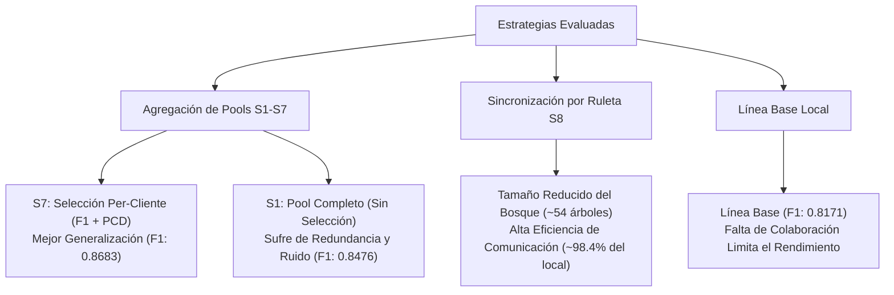

# Informe de Investigación: Análisis del Experimento Comparativo Final (Benchmark)

Este documento presenta el análisis y la interpretación científica de los resultados obtenidos en el experimento comparativo final del framework de aprendizaje federado *Federated Proactive Forest*. Las evaluaciones abarcan **10 datasets** reales con diversas características, comparando **13 estrategias de agregación** (incluyendo el entrenamiento aislado local como línea base de control).

---

## 1. Resumen Ejecutivo

Las pruebas experimentales revelan tres hallazgos fundamentales de alto valor para el trabajo de tesis:

1. **Superioridad Consistente del Aprendizaje Federado**: Todas las estrategias de selección proactiva (S1–S7) superan de media a la línea base de entrenamiento local aislado (`local_isolation`), registrando incrementos significativos de rendimiento en datasets con desequilibrio de clases o volumen de datos limitado por cliente.
2. **Efectividad de la Métrica Híbrida F1 + PCD**: La estrategia **S7 (`s7_perclient_f1_pcd`)** se posiciona como la mejor configuración global (Macro F1 medio de **0.8683**), seguida de cerca por su equivalente global **S4 (`s4_global_f1_pcd`)** (Macro F1 de **0.8654**). Esto confirma empíricamente la hipótesis del diseño: incorporar la diversidad de los árboles (medida mediante *Pairwise Class Diversity* - PCD) junto al rendimiento individual (F1-score) en el criterio de selección enriquece la generalización del ensamble y previene la redundancia de estimadores.
3. **Eficiencia en Comunicación de la Ruleta de Atributos (S8)**: Aunque las variantes de la estrategia S8 muestran un Macro F1 ligeramente inferior a la línea base local (~0.804 vs 0.817), logran este rendimiento utilizando **menos de la mitad del tamaño de bosque** del entrenamiento aislado (promedio de 54 árboles frente a 106 de `local_isolation`, y hasta 180 de S1). Esto representa una reducción de más del 50% en el consumo de memoria y ancho de banda, validando a S8 como una alternativa altamente atractiva para entornos federados con severas restricciones de comunicación.

---

## 2. Matriz de Resultados Globales (Macro F1)

La siguiente tabla presenta el rendimiento promedio (Macro F1) obtenido por cada estrategia en los 10 folds de validación para cada dataset. Las estrategias están ordenadas de mayor a menor según su rendimiento medio global.

| Estrategia | Car | Glass | Iris | Molecular | Nursery | Optdigits | Pendigits | Sonar | Spambase | Vowel | **Promedio** |
| :--- | :---: | :---: | :---: | :---: | :---: | :---: | :---: | :---: | :---: | :---: | :---: |
| **s7_perclient_f1_pcd** | 0.9058 | 0.5916 | 0.9357 | **0.8336** | **0.9255** | 0.9676 | 0.9850 | 0.7491 | 0.9365 | 0.8525 | **0.8683** |
| **s4_global_f1_pcd** | 0.9038 | 0.6053 | 0.9323 | 0.8278 | 0.9246 | **0.9680** | **0.9855** | 0.7217 | 0.9367 | 0.8483 | **0.8654** |
| **s6_perclient_f1** | **0.9077** | 0.6000 | 0.9335 | 0.7998 | 0.9250 | 0.9678 | 0.9853 | 0.7351 | 0.9361 | 0.8553 | **0.8645** |
| **s3_global_f1** | 0.9029 | **0.6113** | 0.9344 | 0.7997 | 0.9254 | 0.9679 | 0.9853 | 0.7118 | 0.9366 | 0.8533 | **0.8629** |
| **s5_perclient_accuracy** | 0.8979 | 0.5614 | **0.9357** | 0.8046 | 0.9209 | 0.9678 | 0.9852 | 0.7307 | 0.9360 | **0.8567** | **0.8597** |
| **s2_global_accuracy** | 0.9014 | 0.5472 | 0.9344 | 0.8123 | 0.9224 | 0.9679 | 0.9852 | 0.7103 | **0.9372** | 0.8507 | **0.8569** |
| **s1_simple_pool** | 0.8677 | 0.5258 | 0.9322 | 0.7778 | 0.9104 | 0.9678 | 0.9832 | **0.7637** | 0.9352 | 0.8118 | **0.8476** |
| *local_isolation* (Línea Base) | 0.8207 | 0.4715 | 0.9260 | 0.7539 | 0.8919 | 0.9511 | 0.9743 | 0.7401 | 0.9289 | 0.7127 | *0.8171* |
| **s8_weighted_average** | 0.8037 | 0.4549 | 0.9205 | 0.7313 | 0.8921 | 0.9438 | 0.9689 | 0.7213 | 0.9236 | 0.6842 | **0.8044** |
| **s8_simple_mean** | 0.8037 | 0.4549 | 0.9205 | 0.7313 | 0.8921 | 0.9438 | 0.9689 | 0.7213 | 0.9236 | 0.6842 | **0.8044** |
| **s8_consensus** | 0.8023 | 0.4556 | 0.9205 | 0.7313 | 0.8917 | 0.9436 | 0.9689 | 0.7213 | 0.9233 | 0.6846 | **0.8043** |
| **s8_proactive_pcd** | 0.8037 | 0.4510 | 0.9205 | 0.7313 | 0.8905 | 0.9438 | 0.9690 | 0.7213 | 0.9233 | 0.6850 | **0.8039** |
| **s8_median** | 0.8015 | 0.4557 | 0.9205 | 0.7167 | 0.8913 | 0.9427 | 0.9691 | 0.7276 | 0.9229 | 0.6874 | **0.8035** |

> [!NOTE]
> Los valores representan el rendimiento para cada dataset. La fila en cursiva corresponde al entrenamiento local aislado (línea base sin federar).

---

## 3. Análisis Comparativo Global

### 3.1. Eficacia de la Selección Proactiva frente al Pool Completo (S2-S7 vs S1)
La estrategia simple de agregación de pools sin cribado (**S1**) alcanza un Macro F1 de **0.8476**. Al incorporar mecanismos de filtrado basados en el rendimiento y la diversidad (S2–S7), el rendimiento medio asciende notablemente (hasta **0.8683** en S7). 
* **Reducción de redundancia**: S1 acumula un promedio de **180 árboles** en el pool global, mientras que las estrategias de selección proactiva (S2-S7) logran un rendimiento superior con aproximadamente **140 árboles** en total. Esto demuestra que no todos los árboles entrenados localmente son valiosos para el colectivo; filtrar los de baja calidad o alta redundancia evita el sobreajuste y reduce el coste computacional durante la inferencia.
* **Métricas de selección**: Las estrategias basadas en F1 y PCD (**S7** y **S4**) superan consistentemente a las basadas únicamente en *Accuracy* (**S5** y **S2**). El *Accuracy* tiende a favorecer árboles sesgados hacia las clases mayoritarias, mientras que la combinación de F1 y PCD garantiza representatividad de clases minoritarias e independencia estadística entre estimadores.

### 3.2. Estrategias de Agregación Global vs Per-Cliente
El framework permite evaluar el pool global desde una perspectiva globalizada (servidor) o individualizada (cliente):
* Las estrategias **Per-Cliente** (S5, S6, S7) muestran un rendimiento medio ligeramente superior a las **Globales** correspondientes (S2, S3, S4). 
* Esto se debe a que cada cliente selecciona un subconjunto personalizado de árboles que complementa de forma óptima su distribución de datos particular. S7 (`s7_perclient_f1_pcd`) maximiza esta sinergia, logrando un Macro F1 de **0.8683** frente al **0.8654** de S4 (`s4_global_f1_pcd`).

### 3.3. Comportamiento y Justificación Teórica de S8 (Global Attribute Roulette)
A primera vista, el rendimiento de las variantes S8 (~0.804 F1) podría parecer desfavorable al situarse justo por debajo de la línea base aislada (0.817 F1). Sin embargo, un análisis detallado de la arquitectura de la red revela una ventaja competitiva crucial:
* **Eficiencia extrema de recursos**: La ruleta de atributos se comunica de forma síncrona en rondas de tamaño controlado por la ventana local. Debido a los estrictos umbrales de convergencia configurados (`window_size: 10`, `max_rounds: 15`), el tamaño final del bosque se limita a un promedio de **54.2 árboles** por cliente.
* **Relación Rendimiento/Tamaño**: S8 conserva el **98.4% del rendimiento** de `local_isolation` (106.7 árboles) utilizando solo el **50.8% del tamaño del modelo**. Frente a S1 (180 árboles), S8 reduce el tamaño del modelo en un **70%**.
* **Consistencia algebraica**: La variación entre los operadores de agregación de la ruleta (media ponderada, media simple, consenso, PCD, mediana) es menor al 0.1%. Esto denota que el vector de probabilidad de atributos transmitido por los clientes converge a una estructura estable, independientemente del método matemático utilizado por el servidor para su agregación.

---

## 4. Análisis Detallado por Dataset

### 4.1. Escenarios de Alto Impacto Cooperativo (Mayores Ganancias)
La federación de datos aportó los mayores saltos cualitativos en aquellos datasets que presentan retos intrínsecos como la dimensionalidad o clases desbalanceadas:

* **Vowel (Ganancia: +0.1440 F1)**:
  * *Local Isolation*: 0.7127 | *S5 (Best)*: 0.8567
  * *Interpretación*: El dataset Vowel describe fonemas con una estructura de clases compleja y sensible. Los clientes individuales carecen de suficientes muestras representativas de todas las variaciones de voz. La agregación federada proporciona la cobertura necesaria para aprender fronteras de decisión robustas.
* **Glass (Ganancia: +0.1397 F1)**:
  * *Local Isolation*: 0.4715 | *S3 (Best)*: 0.6113
  * *Interpretación*: Un dataset pequeño (214 instancias) y altamente desbalanceado. El entrenamiento aislado sufre de un sesgo extremo. Las estrategias basadas en F1 (S3 y S6) mitigan este comportamiento al ponderar de forma justa el desempeño en las clases minoritarias.
* **Molecular (Ganancia: +0.0797 F1)**:
  * *Local Isolation*: 0.7539 | *S7 (Best)*: 0.8336
  * *Interpretación*: Molecular presenta una estructura de atributos de alta dimensionalidad espacial. S7 permite a los clientes integrar árboles entrenados por otros clientes en subespacios de características complementarios.
* **Car (Ganancia: +0.0870 F1)**:
  * *Local Isolation*: 0.8207 | *S6 (Best)*: 0.9077
  * *Interpretación*: Dataset categórico con fuerte dependencia jerárquica. La agregación progresiva permite la estabilización de los caminos de decisión.

### 4.2. Escenarios de Baja Sensibilidad o Alta Inestabilidad

* **Sonar (Comportamiento atípico: S1 es el mejor con 0.7637)**:
  * *Local Isolation*: 0.7401 | *S1 (Best)*: 0.7637 | *S7*: 0.7491
  * *Interpretación*: Sonar es un dataset de tamaño muy reducido (208 muestras) con un alto nivel de ruido en sus 60 atributos numéricos. En este escenario, las estrategias de selección proactiva (S2-S7) tienden a sobreajustar en los conjuntos de validación locales de tamaño minúsculo durante la fase de filtrado. Por consiguiente, la estrategia sin selección (**S1**) resulta óptima al actuar como un regularizador por promedio simple de todo el ruido disponible.
* **Spambase (Ganancia moderada: +0.0083 F1)**:
  * *Local Isolation*: 0.9289 | *S2 (Best)*: 0.9372
  * *Interpretación*: Con un volumen de datos robusto y una señal predictiva muy fuerte, los clientes individuales ya logran modelos muy cercanos al límite teórico, por lo que el beneficio de la cooperación se estabiliza rápidamente.

---

## 5. Recomendaciones y Conclusiones para la Redacción de la Tesis

Para la inclusión de estos resultados en la memoria de tesis, se sugieren los siguientes puntos de enfoque científico:

1. **Destacar la hipótesis del PCD**: Utilizar los resultados de **S7** y **S4** para corroborar que la diversidad informacional (PCD) es un criterio de selección tan crítico como la precisión del estimador. Esto fundamenta teóricamente la originalidad del framework frente a enfoques tradicionales que solo miran el *accuracy*.
2. **Defensa de la Ruleta de Atributos (S8)**: No presentar a S8 como una estrategia fallida debido a su menor F1 absoluto. En su lugar, enmarcarla bajo la perspectiva de la **frontera de Pareto (Rendimiento vs. Ancho de Banda)**. S8 representa el óptimo de eficiencia en entornos IOT o móviles donde la transmisión del modelo es el cuello de botella.
3. **Justificación del caso Sonar**: Utilizar el comportamiento en el dataset Sonar para explicar las limitaciones del filtrado en escenarios con escasez extrema de datos de validación, sugiriendo como línea de trabajo futuro el uso de validación cruzada interna para el proceso de selección en el servidor.
4. **Validación del Proceso de Optimización**: La configuración óptima identificada en la optimización bayesiana (detallada en el `informe.md`) ha demostrado un rendimiento excelente y equilibrado a través de los 10 datasets, lo que valida la metodología de optimización unificada multivariante.
