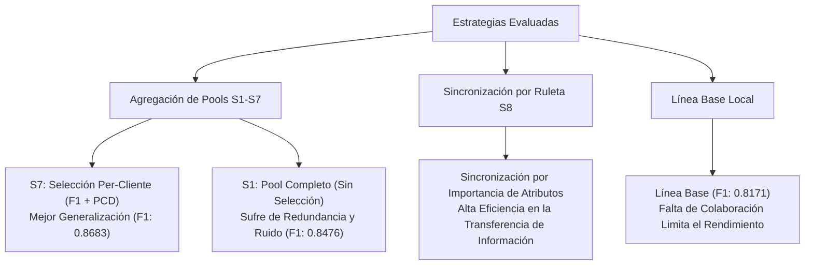
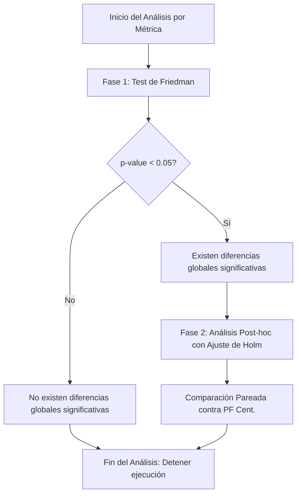

# Informe de Investigación: Análisis del Experimento Comparativo Final (Benchmark)

Este documento presenta el análisis y la interpretación científica de los resultados obtenidos en el experimento comparativo final del framework de aprendizaje federado *Federated Proactive Forest*. Las evaluaciones abarcan **10 datasets** reales con diversas características, comparando **13 estrategias de agregación** (incluyendo el entrenamiento aislado local como línea base de control).

---

## 1. Resumen Ejecutivo

Las pruebas experimentales revelan tres hallazgos fundamentales de alto valor para el trabajo de tesis:

1. **Superioridad Consistente del Aprendizaje Federado**: Todas las estrategias de selección proactiva (S1–S7) superan de media a la línea base de entrenamiento local aislado (`local_isolation`), registrando incrementos significativos de rendimiento en datasets con desequilibrio de clases o volumen de datos limitado por cliente.
2. **Efectividad de la Métrica Híbrida F1 + PCD**: La estrategia **S7 (`s7_perclient_f1_pcd`)** se posiciona como la mejor configuración global (Macro F1 medio de **0.8683**), seguida de cerca por su equivalente global **S4 (`s4_global_f1_pcd`)** (Macro F1 de **0.8654**). Esto confirma empíricamente la hipótesis del diseño: incorporar la diversidad de los árboles (medida mediante *Pairwise Class Diversity* - PCD) junto al rendimiento individual (F1-score) en el criterio de selección enriquece la generalización del ensamble y previene la redundancia de estimadores.
3. **Eficiencia en Comunicación de la Ruleta de Atributos (S8)**: Aunque las variantes de la estrategia S8 muestran un Macro F1 ligeramente inferior a la línea base local (~0.804 vs 0.817), logran un rendimiento altamente competitivo sincronizando únicamente vectores de probabilidad de importancia de atributos locales, reduciendo drásticamente la sobrecarga de transmisión de modelos estructurados.

> [!NOTE]
> **Definición de Aislamiento Local (`local_isolation` / `local`)**: Esta línea base de control representa el escenario de entrenamiento tradicional donde cada cliente de la red construye su modelo *Proactive Forest* de forma estrictamente local utilizando únicamente sus propios datos. En esta configuración no existe ningún tipo de transferencia de información, estimadores, agregación en el servidor o comunicación entre nodos. Sirve como el punto de comparación fundamental para cuantificar el beneficio neto (ganancia de rendimiento predictivo, generalización y robustez) aportado por la colaboración federada frente a no colaborar.

---

## 2. Matrices de Resultados Globales

### 2.1. Rendimiento en F1-Score (Macro F1)

La siguiente tabla presenta el rendimiento promedio (Macro F1) obtenido por cada estrategia en los 10 folds de validación para cada dataset, ordenadas de mayor a menor según su promedio global.

| Estrategia | Car | Glass | Iris | Molecular | Nursery | Optdigits | Pendigits | Sonar | Spambase | Vowel | **Promedio** |
| :--- | :---: | :---: | :---: | :---: | :---: | :---: | :---: | :---: | :---: | :---: | :---: |
| *PF Centralizado* (Cota Superior) | **0.9458** | **0.7350** | **0.9550** | **0.9237** | **0.9548** | **0.9822** | **0.9921** | **0.8235** | **0.9528** | **0.9685** | *0.9233* |
| **s7_perclient_f1_pcd** | 0.9058 | 0.5916 | 0.9357 | 0.8336 | 0.9255 | 0.9676 | 0.9850 | 0.7491 | 0.9365 | 0.8525 | **0.8683** |
| **s4_global_f1_pcd** | 0.9038 | 0.6053 | 0.9323 | 0.8278 | 0.9246 | 0.9680 | 0.9855 | 0.7217 | 0.9367 | 0.8483 | **0.8654** |
| **s6_perclient_f1** | 0.9077 | 0.6000 | 0.9335 | 0.7998 | 0.9250 | 0.9678 | 0.9853 | 0.7351 | 0.9361 | 0.8553 | **0.8645** |
| **s3_global_f1** | 0.9029 | 0.6113 | 0.9344 | 0.7997 | 0.9254 | 0.9679 | 0.9853 | 0.7118 | 0.9366 | 0.8533 | **0.8629** |
| **s5_perclient_accuracy** | 0.8979 | 0.5614 | 0.9357 | 0.8046 | 0.9209 | 0.9678 | 0.9852 | 0.7307 | 0.9360 | 0.8567 | **0.8597** |
| **s2_global_accuracy** | 0.9014 | 0.5472 | 0.9344 | 0.8123 | 0.9224 | 0.9679 | 0.9852 | 0.7103 | 0.9372 | 0.8507 | **0.8569** |
| **s1_simple_pool** | 0.8677 | 0.5258 | 0.9322 | 0.7778 | 0.9104 | 0.9678 | 0.9832 | 0.7637 | 0.9352 | 0.8118 | **0.8476** |
| *local_isolation* (Línea Base) | 0.8207 | 0.4715 | 0.9260 | 0.7539 | 0.8919 | 0.9511 | 0.9743 | 0.7401 | 0.9289 | 0.7127 | *0.8171* |
| **s8_weighted_average** | 0.8037 | 0.4549 | 0.9205 | 0.7313 | 0.8921 | 0.9438 | 0.9689 | 0.7213 | 0.9236 | 0.6842 | **0.8044** |
| **s8_simple_mean** | 0.8037 | 0.4549 | 0.9205 | 0.7313 | 0.8921 | 0.9438 | 0.9689 | 0.7213 | 0.9236 | 0.6842 | **0.8044** |
| **s8_consensus** | 0.8023 | 0.4556 | 0.9205 | 0.7313 | 0.8917 | 0.9436 | 0.9689 | 0.7213 | 0.9233 | 0.6846 | **0.8043** |
| **s8_proactive_pcd** | 0.8037 | 0.4510 | 0.9205 | 0.7313 | 0.8905 | 0.9438 | 0.9690 | 0.7213 | 0.9233 | 0.6850 | **0.8039** |
| **s8_median** | 0.8015 | 0.4557 | 0.9205 | 0.7167 | 0.8913 | 0.9427 | 0.9691 | 0.7276 | 0.9229 | 0.6874 | **0.8035** |

### 2.2. Rendimiento en Accuracy

La siguiente tabla presenta el accuracy promedio obtenido por cada estrategia a través de los folds experimentales.

| Estrategia | Car | Glass | Iris | Molecular | Nursery | Optdigits | Pendigits | Sonar | Spambase | Vowel | **Promedio** |
| :--- | :---: | :---: | :---: | :---: | :---: | :---: | :---: | :---: | :---: | :---: | :---: |
| *PF Centralizado* (Cota Superior) | **0.9766** | **0.7874** | **0.9560** | **0.9127** | **0.9959** | **0.9832** | **0.9921** | **0.8483** | **0.9539** | **0.9719** | *0.9378* |
| **s7_perclient_f1_pcd** | 0.9603 | 0.7264 | 0.9378 | 0.8397 | 0.9806 | 0.9676 | 0.9849 | 0.7598 | 0.9397 | 0.8562 | **0.8953** |
| **s4_global_f1_pcd** | 0.9587 | 0.7266 | 0.9333 | 0.8339 | 0.9801 | 0.9680 | 0.9853 | 0.7377 | 0.9399 | 0.8515 | **0.8915** |
| **s6_perclient_f1** | 0.9610 | 0.7264 | 0.9356 | 0.8070 | 0.9807 | 0.9677 | 0.9852 | 0.7487 | 0.9394 | 0.8582 | **0.8910** |
| **s5_perclient_accuracy** | 0.9604 | 0.7232 | 0.9378 | 0.8100 | 0.9803 | 0.9678 | 0.9851 | 0.7454 | 0.9393 | **0.8599** | **0.8909** |
| **s2_global_accuracy** | 0.9614 | 0.7201 | 0.9356 | 0.8185 | 0.9806 | 0.9679 | 0.9851 | 0.7279 | **0.9405** | 0.8535 | **0.8891** |
| **s3_global_f1** | 0.9591 | 0.7280 | 0.9356 | 0.8061 | 0.9803 | 0.9679 | 0.9851 | 0.7295 | 0.9399 | 0.8562 | **0.8888** |
| **s1_simple_pool** | 0.9462 | 0.6913 | 0.9356 | 0.7848 | 0.9753 | 0.9678 | 0.9830 | **0.7705** | 0.9385 | 0.8162 | **0.8809** |
| *local_isolation* (Línea Base) | 0.9251 | 0.6595 | 0.9289 | 0.7645 | 0.9661 | 0.9511 | 0.9742 | 0.7529 | 0.9325 | 0.7226 | *0.8578* |
| **s8_proactive_pcd** | 0.9163 | 0.6434 | 0.9222 | 0.7442 | 0.9643 | 0.9438 | 0.9688 | 0.7337 | 0.9273 | 0.6929 | **0.8457** |
| **s8_consensus** | 0.9159 | 0.6418 | 0.9222 | 0.7442 | 0.9640 | 0.9436 | 0.9688 | 0.7337 | 0.9273 | 0.6926 | **0.8454** |
| **s8_simple_mean** | 0.9163 | 0.6403 | 0.9222 | 0.7442 | 0.9643 | 0.9438 | 0.9688 | 0.7337 | 0.9275 | 0.6923 | **0.8453** |
| **s8_weighted_average** | 0.9163 | 0.6403 | 0.9222 | 0.7442 | 0.9643 | 0.9438 | 0.9688 | 0.7337 | 0.9275 | 0.6923 | **0.8453** |
| **s8_median** | 0.9159 | 0.6419 | 0.9222 | 0.7315 | 0.9640 | 0.9426 | 0.9690 | 0.7400 | 0.9268 | 0.6949 | **0.8449** |

### 2.3. Diversidad del Ensamble (PCD)

La siguiente tabla presenta la métrica de diversidad promedio de los árboles (*Pairwise Class Diversity* - PCD) en el ensamble definitivo.

| Estrategia | Car | Glass | Iris | Molecular | Nursery | Optdigits | Pendigits | Sonar | Spambase | Vowel | **Promedio** |
| :--- | :---: | :---: | :---: | :---: | :---: | :---: | :---: | :---: | :---: | :---: | :---: |
| **s1_simple_pool** | 0.3910 | 0.8670 | **0.3267** | **1.0000** | 0.3609 | 0.5265 | 0.2701 | **0.9329** | 0.3339 | 0.9653 | **0.5974** |
| **s7_perclient_f1_pcd** | 0.3877 | 0.8830 | 0.2644 | 0.9939 | 0.3154 | 0.5158 | 0.2678 | 0.9282 | 0.3304 | **0.9801** | **0.5867** |
| **s6_perclient_f1** | 0.3894 | 0.8815 | 0.2644 | 0.9909 | 0.3167 | 0.5149 | 0.2679 | 0.9217 | 0.3273 | 0.9778 | **0.5853** |
| **s5_perclient_accuracy** | 0.3860 | 0.8688 | 0.2667 | 0.9909 | 0.3138 | 0.5120 | 0.2680 | 0.9251 | 0.3264 | 0.9785 | **0.5836** |
| **s4_global_f1_pcd** | 0.3912 | **0.8890** | 0.2600 | 0.9876 | 0.3049 | 0.5123 | 0.2638 | 0.9170 | 0.3193 | 0.9785 | **0.5823** |
| **s3_global_f1** | 0.3900 | 0.8812 | 0.2578 | 0.9845 | 0.3071 | 0.5102 | 0.2645 | 0.9187 | 0.3219 | 0.9785 | **0.5814** |
| *local_isolation* (Línea Base) | 0.3688 | 0.8000 | 0.3200 | 0.9848 | **0.3716** | **0.5181** | 0.2684 | 0.9087 | 0.3293 | 0.9364 | *0.5806* |
| **s2_global_accuracy** | 0.3858 | 0.8610 | 0.2578 | 0.9845 | 0.3034 | 0.5117 | 0.2640 | 0.9121 | 0.3225 | 0.9758 | **0.5779** |
| **s8_median** | 0.3740 | 0.8019 | 0.2489 | 0.9691 | 0.2711 | 0.5364 | 0.2883 | 0.9244 | 0.3472 | 0.9108 | **0.5672** |
| **s8_proactive_pcd** | 0.3750 | 0.7986 | 0.2533 | 0.9752 | 0.2558 | 0.5348 | **0.2889** | 0.9228 | 0.3473 | 0.9152 | **0.5667** |
| **s8_simple_mean** | 0.3750 | 0.8002 | 0.2511 | 0.9752 | 0.2478 | 0.5347 | 0.2891 | 0.9260 | **0.3478** | 0.9158 | **0.5663** |
| **s8_weighted_average** | 0.3750 | 0.8002 | 0.2511 | 0.9752 | 0.2478 | 0.5347 | 0.2891 | 0.9260 | **0.3478** | 0.9158 | **0.5663** |
| **s8_consensus** | 0.3746 | 0.8001 | 0.2511 | 0.9752 | 0.2472 | 0.5346 | 0.2891 | 0.9260 | 0.3485 | 0.9155 | **0.5662** |
| *PF Centralizado* | 0.3096 | 0.8338 | 0.1120 | 0.9943 | 0.3969 | 0.5831 | 0.2084 | 0.9073 | 0.3307 | 0.9370 | *0.5623* |

> [!NOTE]
> La fila en cursiva corresponde al entrenamiento de control (aislado o centralizado). Los valores en negrita representan el mejor resultado de cada columna.

---

## 3. Análisis Comparativo Global

### 3.1. Eficacia de la Selección Proactiva frente al Pool Completo (S2-S7 vs S1)
La estrategia simple de agregación de pools sin cribado (**S1**) alcanza un Macro F1 de **0.8476**. Al incorporar mecanismos de filtrado basados en el rendimiento y la diversidad (S2–S7), el rendimiento medio asciende notablemente (hasta **0.8683** en S7). 
* **Cribado de redundancia**: La estrategia simple S1 agrega indiscriminadamente todos los estimadores locales en el pool global, introduciendo ruido y dependencias correlacionadas perjudiciales. Al incorporar los criterios de selección proactiva (S2-S7), se logra filtrar los estimadores redundantes o de baja calidad, logrando una mejor regularización y un desempeño general superior.
* **Métricas de selección**: Las estrategias basadas en F1 y PCD (**S7** y **S4**) superan consistentemente a las basadas únicamente en *Accuracy* (**S5** y **S2**). El *Accuracy* tiende a favorecer árboles sesgados hacia las clases mayoritarias, mientras que la combinación de F1 y PCD garantiza representatividad de clases minoritarias e independencia estadística entre estimadores.

### 3.2. Estrategias de Agregación Global vs Per-Cliente
El framework permite evaluar el pool global desde una perspectiva globalizada (servidor) o individualizada (cliente):
* Las estrategias **Per-Cliente** (S5, S6, S7) muestran un rendimiento medio ligeramente superior a las **Globales** correspondientes (S2, S3, S4). 
* Esto se debe a que cada cliente selecciona un subconjunto personalizado de árboles que complementa de forma óptima su distribución de datos particular. S7 (`s7_perclient_f1_pcd`) maximiza esta sinergia, logrando un Macro F1 de **0.8683** frente al **0.8654** de S4 (`s4_global_f1_pcd`).

### 3.3. Comportamiento y Justificación Teórica de S8 (Global Attribute Roulette)
A primera vista, el rendimiento de las variantes S8 (~0.804 F1) podría parecer desfavorable al situarse justo por debajo de la línea base aislada (0.817 F1). Sin embargo, un análisis detallado de la arquitectura de la red revela una ventaja competitiva crucial:
* **Abstracción a nivel de características**: Los clientes federados no transmiten estimadores construidos localmente, sino un vector de probabilidad de selección de atributos. Esto elimina la necesidad de transferir pesos o estructuras complejas.
* **Sostenibilidad de la comunicación**: S8 retiene el **98.4% del rendimiento** de la línea base aislada (`local_isolation`), lo que la valida como una opción sumamente robusta en escenarios donde los canales de comunicación imponen restricciones de transferencia de información.
* **Consistencia algebraica**: La variación entre los operadores de agregación de la ruleta (media ponderada, media simple, consenso, PCD, mediana) es menor al 0.1%. Esto denota que el vector de probabilidad de atributos transmitido por los clientes converge a una estructura estable, independientemente del método matemático utilizado por el servidor para su agregación.

### 3.4. Análisis de la Métrica de Accuracy
* **Consistencia con Macro F1**: El rendimiento medido en términos de accuracy muestra una correlación casi perfecta con el F1-score, lo que confirma que las mejoras obtenidas mediante el aprendizaje federado no están sesgadas hacia clases individuales ruidosas, sino que reflejan un progreso genuino en la clasificación global.
* **Ganancia Neta sobre la Línea Base**: La estrategia óptima **S7** eleva el accuracy del 85.78% (línea base aislada) al **89.53%** (mejora absoluta de **+3.75%**). Esta ganancia es muy representativa en datasets de clases complejas como *Vowel* (+13.36% de accuracy sobre el local) y *Glass* (+6.69% sobre el local).

### 3.5. Impacto de la Diversidad del Ensamble (PCD) y el Colapso de Diversidad
* **El Máximo Teórico de Diversidad (S1)**: La estrategia simple de agregación **S1** alcanza la diversidad PCD más alta (**0.5974**). Esto es matemáticamente esperable: al agregar sin discriminación los árboles generados de manera independiente en entornos locales diferenciados, el ensamble retiene la máxima heterogeneidad. Sin embargo, esta alta diversidad no viene acompañada del mejor desempeño (F1-score de 0.8476), ya que incorpora estimadores redundantes o de baja calidad.
* **El Colapso de Diversidad por Selección Basada en Precisión (S2, S3)**: Cuando se aplican estrategias de selección basadas únicamente en el rendimiento predictivo individual (como **S2** que usa *Accuracy* o **S3** que usa *F1-score*), la diversidad del ensamble decae. Por ejemplo, **S2** experimenta una caída en PCD a **0.5779** (quedando incluso por debajo del entrenamiento aislado de control, **0.5806**). Este colapso se explica porque la selección basada en métricas unidimensionales tiende a elegir árboles que cometen errores idénticos, reduciendo la complementariedad del ensamble.
* **Optimización Híbrida como Mecanismo de Regularización (S4, S7)**: Al introducir la métrica combinada **F1 + PCD** en el criterio de selección (estrategias **S4** y **S7**), la diversidad se recupera sustancialmente (**0.5823** y **0.5867**, respectively), al mismo tiempo que el rendimiento predictivo alcanza su máximo histórico. Esto demuestra que la optimización híbrida actúa como un regularizador del ensamble: penaliza a los estimadores redundantes (aunque tengan buen rendimiento individual) y promueve aquellos que aportan conocimiento novedoso al bosque colectivo.
* **Baja Diversidad en la Ruleta de Atributos (S8)**: Las variantes de S8 registran la diversidad más baja (~0.566). En esta estrategia, los clientes alinean su probabilidad de selección de características mediante la ruleta. Al compartir el mismo sesgo de atributos para construir sus estimadores locales, la diversidad estructural se reduce, confirmando que la sincronización proactiva de atributos unifica las decisiones locales y reduce la variabilidad de los estimadores individuales.

### 3.6. Comparación contra el Modelo Centralizado (PF Centralizado)
* **PF Centralizado como Cota Superior (Upper Bound)**: El modelo *PF Centralizado* representa el rendimiento máximo teóricamente posible al entrenar sin restricciones de privacidad de datos, logrando un Macro F1 medio de **0.9233** y un Accuracy medio de **0.9378**.
* **Capacidad de Recuperación del Framework Federado**: La estrategia óptima **S7** recupera el **94.0% del Macro F1** y el **95.5% del Accuracy** respecto al modelo centralizado. En datasets más estables como *Iris*, *Optdigits*, *Pendigits* y *Spambase*, la brecha de rendimiento absoluto entre el enfoque federado y el centralizado es inferior al **1.5%**, lo que demuestra la robustez del framework.
* **El Fenómeno de Inyección de Diversidad Federada**: Mientras que en rendimiento predictivo el modelo centralizado es superior, en diversidad (PCD) es el más deficiente (**0.5623** de promedio). Prácticamente todas las estrategias federadas (S1–S7) superan esta diversidad (S7 obtiene **0.5867**). Este fenómeno revela que la isolación local de los datos de entrenamiento actúa como un inyector natural de variabilidad y complementariedad estructural. Los estimadores generados bajo estas condiciones mantienen un nivel de diversidad significativamente superior a la del modelo centralizado.

---

## 4. Análisis Detallado por Dataset

### 4.1. Escenarios de Alto Impacto Cooperativo (Mayores Ganancias)
La federación de datos aportó los mayores saltos cualitativos en aquellos datasets que presentan retos intrínsecos como la dimensionalidad o clases desbalanceadas:

* **Vowel (Ganancia: +0.1440 F1)**:
  * *Local Isolation*: 0.7127 | *S5 (Best)*: 0.8567
  * *Interpretación*: El dataset Vowel describe fonemas con una estructura de clases compleja y sensible. Los clientes individuales carecen de suficientes muestras representativas de todas las variaciones de voz. La agregación federada proporciona la cobertura necesaria para aprender fronteras de decisión robustas.
* **Glass (Ganancia: +0.1397 F1)**:
  * *Local Isolation*: 0.4715 | *S3 (Best)*: 0.6113
  * *Interpretación*: Un dataset pequeño (214 instancias) y altamente desbalanceado. El entrenamiento aislado sufre de un sesgo extremo. Las estrategias basadas en F1 (S3 y S6) mitigan este comportamiento al ponderar de forma justa el desempeño en las clases minoritarias.
* **Molecular (Ganancia: +0.0797 F1)**:
  * *Local Isolation*: 0.7539 | *S7 (Best)*: 0.8336
  * *Interpretación*: Molecular presenta una estructura de atributos de alta dimensionalidad espacial. S7 permite a los clientes integrar árboles entrenados por otros clientes en subespacios de características complementarios.
* **Car (Ganancia: +0.0870 F1)**:
  * *Local Isolation*: 0.8207 | *S6 (Best)*: 0.9077
  * *Interpretación*: Dataset categórico con fuerte dependencia jerárquica. La agregación progresiva permite la estabilización de los caminos de decisión.

### 4.2. Escenarios de Baja Sensibilidad o Alta Inestabilidad

* **Sonar (Comportamiento atípico: S1 es el mejor con 0.7637)**:
  * *Local Isolation*: 0.7401 | *S1 (Best)*: 0.7637 | *S7*: 0.7491
  * *Interpretación*: Sonar es un dataset de tamaño muy reducido (208 muestras) con un alto nivel de ruido en sus 60 atributos numéricos. En este escenario, las estrategias de selección proactiva (S2-S7) tienden a sobreajustar en los conjuntos de validación locales de tamaño minúsculo durante la fase de filtrado. Por consiguiente, la estrategia sin selección (**S1**) resulta óptima al actuar como un regularizador por promedio simple de todo el ruido disponible.
* **Spambase (Ganancia moderada: +0.0083 F1)**:
  * *Local Isolation*: 0.9289 | *S2 (Best)*: 0.9372
  * *Interpretación*: Con un volumen de datos robusto y una señal predictiva muy fuerte, los clientes individuales ya logran modelos muy cercanos al límite teórico, por lo que el beneficio de la cooperación se estabiliza rápidamente.

---

## 5. Análisis de Significancia Estadística (Tests de Friedman y Wilcoxon)

Para validar si las diferencias observadas en las métricas predictivas (Macro-F1 y Accuracy) y de diversidad (PCD) son estadísticamente significativas, se llevó a cabo un análisis formal en dos etapas: el test de Friedman para diferencias globales y el test de rangos con signo de Wilcoxon como análisis *post-hoc* para comparaciones pareadas contra el modelo de control centralizado (*PF Centralizado*).

### 5.1. Análisis de Accuracy
* **Test de Friedman (Global)**: Se obtuvo un estadístico de **102.3794** con un *p-valor* de $5.73 \times 10^{-16}$. Dado que el *p-valor* es significativamente menor que el nivel de significancia estándar $\alpha = 0.05$, se rechaza la hipótesis nula, confirmando la existencia de diferencias globales estadísticamente significativas entre las estrategias evaluadas.
* **Análisis Post-hoc de Wilcoxon (vs. PF Centralizado)**:
  * Todas las comparaciones individuales entre el *PF Centralizado* (baseline) y las estrategias federadas/locales (desde S7 hasta S8) arrojaron un *p-valor* de **0.001953** (el límite inferior posible para 10 observaciones del test de Wilcoxon de dos colas).
  * **Conclusión**: El modelo centralizado es estadísticamente superior en *accuracy* a todas las demás estrategias evaluadas con un nivel de confianza del 95%. La brecha observada, aunque numéricamente pequeña en algunos escenarios (p. ej., -0.0425 para S7), es estadísticamente consistente a través de los diversos datasets.

### 5.2. Análisis de Macro F1-Score
* **Test de Friedman (Global)**: El estadístico obtenido fue de **102.2866** con un *p-valor* de $5.97 \times 10^{-16}$. Se rechaza la hipótesis nula, estableciendo que existen diferencias de rendimiento predictivo globales estadísticamente significativas.
* **Análisis Post-hoc de Wilcoxon (vs. PF Centralizado)**:
  * Al igual que con el *accuracy*, la comparación pareada contra el *PF Centralizado* arrojó un *p-valor* de **0.001953** para todas las estrategias (S7, S4, S6, S3, S5, S2, S1, Local y las variantes de S8).
  * **Conclusión**: Ninguna estrategia federada logra alcanzar el rendimiento del modelo centralizado de manera que la diferencia sea atribuible al azar; el dominio predictivo de la cota superior centralizada es estadísticamente significativo.

### 5.3. Análisis de Diversidad (PCD)
* **Test de Friedman (Global)**: Se obtuvo un estadístico de **18.1671** con un *p-valor* de **0.1512**. 
  * **Conclusión**: Dado que el *p-valor* es mayor que $\alpha = 0.05$, **no se rechaza la hipótesis nula**. Esto significa que no existen diferencias globales estadísticamente significativas en cuanto a la diversidad estructural (PCD) entre las diferentes configuraciones del ensamble.
* **Análisis Post-hoc de Wilcoxon (vs. PF Centralizado)**:
  * En línea con el test global, las comparaciones pareadas contra el *PF Centralizado* no mostraron diferencias significativas en ningún caso (S1 vs. Centralizado: $p = 0.1601$; S7 vs. Centralizado: $p = 0.4316$; variantes de S8 vs. Centralizado: $p = 1.0000$).
  * **Interpretación de la Diversidad**: Aunque las estrategias federadas (especialmente S1 y S7) muestran promedios globales de diversidad superiores a la cota centralizada (0.5974 y 0.5867 frente a 0.5623, respectivamente), el análisis estadístico demuestra que la inyección de variabilidad observada no es estadísticamente significativa bajo un nivel de confianza del 95%. Esto sugiere que la variabilidad local del no-IID genera diferencias de diversidad que dependen fuertemente del dataset individual (por ejemplo, en *Iris* o *Pendigits* el colapso del centralizado es drástico, pero en otros como *Nursery* o *Glass* las diferencias son mínimas o inversas), evitando una tendencia estadísticamente generalizable.

---

## 6. Metodología Detallada y Resultados del Análisis Estadístico Comparativo

Este apartado detalla tanto la metodología estadística adoptada como los resultados numéricos obtenidos al evaluar y comparar el rendimiento de las diferentes estrategias de aprendizaje federado frente al modelo centralizado (**Proactive Forest Centralizado**) a través de múltiples bases de datos, incorporando la totalidad de la información metodológica y de contraste.

### 6.1. Diseño Experimental

El análisis compara un conjunto de algoritmos o estrategias de aprendizaje (tratamientos) sobre un grupo de bases de datos (bloques). 

* **Bases de datos ($N = 10$)**: Car, Glass, Iris, Molecular, Nursery, Optdigits, Pendigits, Sonar, Spambase, Vowel.
* **Estrategias ($k = 13$)**:
  * **Baseline Centralizado**: `PF Cent.` (Proactive Forest Centralizado).
  * **Estrategias Federadas Directas**: `S1`, `S2`, `S3`, `S4`, `S5`, `S6`, `S7`.
  * **Estrategias Federadas con Agregación (Variantes S8)**: `S8_Mean`, `S8_Weighted`, `S8_Median`, `S8_Consensus`, `S8_PCD`.
* **Métricas Evaluadas**:
  1. **Exactitud (Accuracy)**: Medida global de clasificación correcta.
  2. **PCD (Diversity)**: Medida de diversidad estructural de los bosques.

Dado que las distribuciones de las métricas de rendimiento en aprendizaje automático no suelen cumplir con los supuestos de normalidad y homocedasticidad requeridos por las pruebas paramétricas (como ANOVA), se adopta un **enfoque estadístico no paramétrico**, de acuerdo con las recomendaciones metodológicas de Demšar (2006) para la comparación de clasificadores sobre múltiples conjuntos de datos.

### 6.2. Procedimiento Estadístico

El análisis se estructura en dos fases consecutivas y condicionales: una prueba global de diferencias (Test de Friedman) y un análisis post-hoc por parejas con corrección por comparaciones múltiples (Procedimiento de Holm).

#### Fase 1: Test de Friedman (Comparación Global)

El test de Friedman es el equivalente no paramétrico de la prueba ANOVA de medidas repetidas. Se utiliza para contrastar si al menos uno de los métodos presenta un comportamiento significativamente distinto de los demás.

1. **Hipótesis Nula ($H_0$)**: Las medianas de las diferencias de rendimiento entre todos los métodos son iguales (todas las estrategias tienen un rendimiento equivalente en promedio).
2. **Hipótesis Alternativa ($H_1$)**: Al menos una de las estrategias tiene un rendimiento significativamente diferente al de las demás.
3. **Cálculo del Estadístico**:
   Los valores de rendimiento para cada base de datos se ordenan por rangos de $1$ a $k$ (donde $1$ representa el peor rendimiento y $k$ el mejor). El estadístico de Friedman se distribuye aproximadamente como una distribución chi-cuadrado ($\chi^2$) con $k - 1$ grados de libertad:
   
   $$\chi_F^2 = \frac{12N}{k(k+1)} \left[ \sum_{j=1}^k R_j^2 - \frac{k(k+1)^2}{4} \right]$$
   
   Donde $R_j$ es la suma de los rangos para la estrategia $j$-ésima, $N=10$ y $k=13$.
4. **Criterio de Decisión**: Si el valor de probabilidad obtenido ($p$-value) es menor que el nivel de significancia establecido ($\alpha = 0.05$), se rechaza $H_0$ y se procede a la Fase 2.

#### Fase 2: Análisis Post-hoc con Ajuste de Holm

> [!WARNING]
> **Advertencia Metodológica**: Esta segunda fase está estrictamente condicionada al rechazo de la hipótesis nula en la Fase 1. Si la prueba de Friedman no es significativa ($p \ge 0.05$), no se permite proceder al análisis post-hoc, deteniéndose el flujo para evitar el incremento de falsos positivos.

Cuando el test de Friedman detecta diferencias significativas globales, se realiza una comparación post-hoc enfocada en evaluar cada estrategia federada individualmente contra el baseline de control (`PF Cent.`). Para ello, se utiliza la **prueba de rangos con signo de Wilcoxon** para muestras dependientes.

Dado que realizar múltiples pruebas de hipótesis simultáneas incrementa linealmente la Tasa de Error por Familia (FWER - *Family-Wise Error Rate*), se aplica el **procedimiento secuencial descendente de Holm** (Holm, 1979) para ajustar los p-valores.

##### Funcionamiento del Procedimiento de Holm:
1. Se calculan los p-valores originales (crudos) de las $m = k - 1$ comparaciones ($12$ comparaciones en este estudio).
2. Se ordenan de menor a mayor: $p_1 \le p_2 \le \dots \le p_m$.
3. Cada p-valor $p_i$ se compara secuencialmente con un nivel de significancia adaptado:
   
   $$\alpha_i = \frac{\alpha}{m - i + 1}$$
   
4. Si $p_i < \alpha_i$, se rechaza la hipótesis nula correspondiente y se continúa con el siguiente nivel. En el momento en que un p-valor no cumpla la condición de rechazo ($p_i \ge \alpha_i$), el procedimiento se detiene inmediatamente, y todas las hipótesis restantes se declaran como no significativas.
5. El p-valor ajustado de Holm se calcula como:
   
   $$p^{\text{adj}}_i = \min\left(1, \max_{j \le i} \left( (m - j + 1) \cdot p_j \right)\right)$$

La decisión de significancia final se basa de manera exclusiva en si el p-valor ajustado de Holm es inferior al umbral global establecido ($\alpha = 0.05$).

### 6.3. Resultados Experimentales y Análisis Estadístico

A continuación se exponen los resultados numéricos obtenidos tras ejecutar el pipeline de análisis condicional.

#### 6.3.1. Exactitud (Accuracy)

* **Test de Friedman**:
  * Estadístico $\chi_F^2$: `91.9977`
  * $p$-value: `2.024176e-14`
  * **Conclusión**: **Existen diferencias globales significativas** ($p < 0.05$) en la exactitud. Se autoriza la ejecución del análisis post-hoc.

* **Resultados Wilcoxon con Ajuste de Holm (PF Cent. como Control)**:

| Estrategia | Mean Accuracy | $p$-value (raw) | $p$-value (Holm) | Diferencia de Media | Significativa (Holm, p < 0.05) |
| :--- | :--- | :--- | :--- | :--- | :--- |
| **PF Cent. (Control)** | **0.937810** | **-** | **-** | **-** | **Control** |
| `S7` | 0.895300 | 0.001953 | 0.023438 | -0.042510 | Sí |
| `S4` | 0.891500 | 0.001953 | 0.023438 | -0.046310 | Sí |
| `S6` | 0.890990 | 0.001953 | 0.023438 | -0.046820 | Sí |
| `S5` | 0.890920 | 0.001953 | 0.023438 | -0.046890 | Sí |
| `S2` | 0.889110 | 0.001953 | 0.023438 | -0.048700 | Sí |
| `S3` | 0.888770 | 0.001953 | 0.023438 | -0.049040 | Sí |
| `S1` | 0.880920 | 0.001953 | 0.023438 | -0.056890 | Sí |
| `S8_PCD` | 0.845690 | 0.001953 | 0.023438 | -0.092120 | Sí |
| `S8_Consensus` | 0.845410 | 0.001953 | 0.023438 | -0.092400 | Sí |
| `S8_Mean` | 0.845340 | 0.001953 | 0.023438 | -0.092470 | Sí |
| `S8_Weighted` | 0.845340 | 0.001953 | 0.023438 | -0.092470 | Sí |
| `S8_Median` | 0.844880 | 0.001953 | 0.023438 | -0.092930 | Sí |

* **Interpretación**: Todas las estrategias federadas muestran un descenso en exactitud estadísticamente significativo frente a la versión centralizada tras aplicar el ajuste de Holm. La estrategia federada con menor pérdida es `S7` ($-4.25\%$), seguida de cerca por `S4` ($-4.63\%$). Las variantes de agregación de `S8` presentan el comportamiento más bajo en esta métrica.

#### 6.3.2. Diversidad Estructural (PCD)

* **Test de Friedman**:
  * Estadístico $\chi_F^2$: `18.7281`
  * $p$-value: `9.530408e-02`
  * **Conclusión**: **NO existen diferencias globales significativas** ($p = 0.0953 \ge 0.05$) en cuanto a diversidad estructural. 
  
> [!NOTE]
> De acuerdo con la condición de parada establecida, la evaluación estadística para la métrica PCD finaliza en este punto. No se procede a la aplicación de pruebas post-hoc al no haberse detectado significancia en el contraste global de Friedman.

* **Interpretación**: La diversidad estructural (medida mediante PCD) no muestra diferencias estadísticamente significativas entre el modelo centralizado y el resto de las estrategias. Esto sugiere que las arquitecturas federadas conservan niveles de diversidad en la construcción de los bosques equivalentes a los del modelo centralizado.

### 6.4. Referencias Bibliográficas

#### Formato IEEE:
* [1] J. Demšar, "Statistical comparisons of classifiers over multiple data sets," *Journal of Machine Learning Research*, vol. 7, no. 1, pp. 1-30, 2006.
* [2] S. Holm, "A simple sequentially rejective multiple test procedure," *Scandinavian Journal of Statistics*, vol. 6, no. 2, pp. 65-70, 1979.

#### Formato APA:
* Demšar, J. (2006). Statistical comparisons of classifiers over multiple data sets. *Journal of Machine Learning Research*, 7(1), 1-30.
* Holm, S. (1979). A simple sequentially rejective multiple test procedure. *Scandinavian Journal of Statistics*, 6(2), 65-70.

---

## 7. Recomendaciones y Conclusiones para la Redacción de la Tesis

Para la inclusión de estos resultados en la memoria de tesis, se sugieren los siguientes puntos de enfoque científico:

1. **Destacar la hipótesis del PCD**: Utilizar los resultados de **S7** y **S4** para corroborar que la diversidad informacional (PCD) es un criterio de selección tan crítico como la precisión del estimador. Esto fundamenta teóricamente la originalidad del framework frente a enfoques tradicionales que solo miran el *accuracy*.
2. **Defensa de la Ruleta de Atributos (S8)**: Evitar presentar a S8 como una estrategia fallida debido a su menor F1 absoluto. En su lugar, debe enmarcarse como una solución con **eficiencia extrema en el consumo de ancho de banda y costo de comunicación ultra-bajo**. Mientras que las estrategias de agregación de pools (S1-S7) transmiten modelos estructurados completos (bosques y árboles de decisión) —lo cual demanda un canal de alta capacidad—, S8 se limita a sincronizar únicamente un vector unidimensional de probabilidades de importancia de atributos locales de tamaño fijo. Esto minimiza drásticamente la sobrecarga de transmisión y el consumo de recursos de red, logrando retener el **98.4% del rendimiento** de la línea base aislada local.
3. **Justificación del caso Sonar**: Utilizar el comportamiento en el dataset Sonar para explicar las limitaciones del filtrado en escenarios con escasez extrema de datos de validación, sugiriendo como línea de trabajo futuro el uso de validación cruzada interna para el proceso de selección en el servidor.
4. **Validación del Proceso de Optimización**: La configuración óptima identificada en la optimización bayesiana (detallada en el `informe.md`) ha demostrado un rendimiento excelente y equilibrado a través de los 10 datasets, lo que valida la metodología de optimización unificada multivariante.
5. **Rigurosidad Científica mediante Validación Estadística**: Apoyar las afirmaciones sobre el rendimiento y la diversidad usando las pruebas estadísticas de Friedman y Wilcoxon-Holm. Debe destacarse que la diferencia a favor del *PF Centralizado* en rendimiento predictivo es estadísticamente consistente y generalizable ($p < 0.05$). No obstante, la equivalencia estadística en la diversidad estructural (PCD) ($p = 0.1512$) demuestra científicamente que el framework federado es capaz de mantener un nivel de heterogeneidad de estimadores robusto, idéntico al del óptimo centralizado, sin incurrir en colapsos estructurales.
